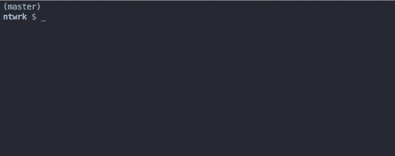

[](https://badge.fury.io/js/apphubdeploy)

**Build and Deploy [AppHub.io][1] in one fell swoop.**




## Installation

```bash
npm install --global apphubdeploy
```

This will install AppHubDeploy globally so you can use it in all of your AppHub projects without installing it for each one.


## Usage

_Run from your project root directory._

This will build and deploy to AppHub.io with the default settings:

```bash
$ apphubdeploy

```

**Build and Deploy with Options**

The real power of AppHub Deploy comes when you add options such as `-t` / `--target` allowing you to deliver over-the-air (OTA) updates to your users via AppHub.io without ever leaving the command line. **Powerful stuff!**

For example, this will create and deploy a build with a **name** and **description** that's targeted to your **debug** users who are running **version 1.0.3** of your app:

```bash
$ apphubdeploy -n "Build Name" -d "Build Description" -t debug -a '["1.0.3"]'
```

Less time clicking and more time being awesome.


#### AppHub Credentials

The first time you call `apphubdeploy` in a project directory it will prompt you for your **AppHub ID** and **AppHub Secret**, which can be found on the settings panel of your [AppHub.io][1] account.

Your AppHub credentials will be stored in a `.apphub` file that is readable only by you for security. Going forward, it will try to read your AppHub credentials from this file instead of prompting you.

In the event that you need to change your AppHub credentials, either modify the `.apphub` file itself or simply run `apphubdeploy` with the `--configure` option, like `apphubdeploy --configure`, and you will be prompted for your credentials again.


## Options

You can pass a number of options to the `apphubdeploy` command in order to specify how the build will be treated by AppHub as well as other options for the CLI like `--verbose`.


#### AppHub Build Options

Short Flag | Long Flag                          | Description
-----------|------------------------------------|------------
-a         | --app-versions <app-versions>      | Array of app version strings that are compatible with this build. <br> **MUST wrap version numbers in double quotes!** <br> Example: `-a '["1.0.3", "1.0.4"]'` <br> Defaults to value in `info.plist` of build file.
-d         | --build-description <description>  | Description of the build. Wrap in quotes if more than one word.
-n         | --build-name <name>                | Name of the build. Wrap in quotes if more than one word.
-t         | --target <target>                  | One of `all`, `debug` or `none` which specifies the target audience of the build. Defaults to `none`.


#### CLI Options

Short Flag | Long Flag                          | Description
-----------|------------------------------------|------------
-c         | --configure                        | (Re)Configure AppHub ID and Secret key.
-h         | --help                             | Output usage information.
-o         | --open-build-url                   | Open AppHub Builds URL with your default browser after a successful build and deploy
-r         | --retain-build                     | Do not remove the build after a successful deploy. By default it will be removed.
-v         | --verbose                          | Unleashes "Chatty Kathy" to the STDOUT - great for debugging!
-V         | --version                          | Output the version number.


## Many Thanks To

* My friend **[Irfaan][irfaan]** for tirelessly helping test the early versions and providing endless encouragment.
* **[Matt][matt]** over at AppHub for working through uploading to their REST API with me.
* The **[AppHub.io Platform][1]**, in general, for producing such a useful and easy-to-use tool that inspires and streamlines our development.


## License

The MIT License (MIT)

Copyright (c) 2016 - `Time.now()`, Joshua Pinter


[1]: https://apphub.io/
[irfaan]: https://twitter.com/irfaan
[matt]: https://twitter.com/m_arbesfeld
